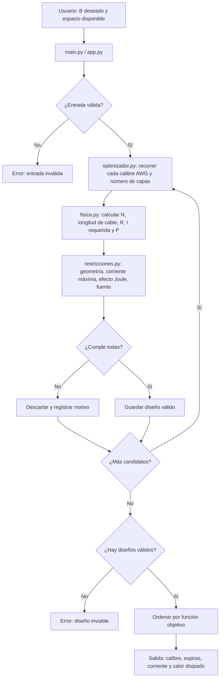

## Abstract

El proyecto implementa una herramienta de diseño de electroimanes (solenoides) con una **arquitectura por capas** en Python. La capa de **física** (`fisica.py`) agrupa las ecuaciones B = µ₀(N/L)I y P = I²R como funciones puras. La capa de **datos** (`awg.csv`, `modelos.py`) almacena las propiedades de los cables AWG y define las estructuras Cable, Especificación y Diseño. La capa de **restricciones** (`restricciones.py`) descarta los diseños inviables por geometría, corriente máxima, calentamiento por efecto Joule y límites de la fuente. La capa de **optimización** (`optimizador.py`) enumera las combinaciones de calibre y número de capas, calcula la corriente requerida, aplica las restricciones y ordena los diseños válidos según una función objetivo. Finalmente, la capa de **interfaz** (`main.py` por consola y `app.py` en Streamlit) solo recibe datos y muestra resultados, sin lógica propia.

## Por qué esta arquitectura

- **Separación de responsabilidades:** la física no depende de la interfaz ni del optimizador, así que cada parte se puede desarrollar y probar por separado.
- **Validación sencilla:** al ser funciones puras, las ecuaciones se contrastan con cálculos manuales (semana 5) mediante pruebas automáticas.
- **Cambios sin romper nada:** se puede reemplazar la interfaz o el modelo térmico sin tocar el resto del código.
- **Espacio de búsqueda pequeño:** al despejar la corriente a partir de B, solo hay que enumerar calibre y capas, por lo que no hacen falta heurísticas complejas.
- **Trazabilidad:** cada restricción informa el motivo de rechazo, lo que ayuda a explicar los resultados en la sustentación.
- **Alineación con el cronograma:** cada módulo corresponde a una semana de trabajo.

## Diagrama de flujo

